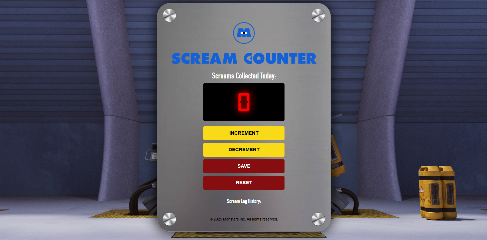

# Scream Counter

**About**  
This project personalises a counter app built during the *Making Websites Interactive* module in the Scrimba Frontend Developer course. Inspired by my love of movies, I modified the counter to reflect a contol panel  that might be used to count screams in the universe of *Monsters, Inc.*.

The brief for the project was to modify the app by:  
- Choosing a title that interests you.  
- Changing the background image.  
- Using a custom font.  
- Modifying the button colours and appearance.  
- Wrapping the HTML elements in a div and setting a max width.  

## Features
**Standard**
- Increment the displayed counter by 1.
- Append the current value to a string containing past counts. 
  
**Addtional** (features and styling added outside of original scope)  
- Decrement button to rdeuce the count by one (incase it was accidentally incremented).
- Reset button added that resets all values back to 0.
- Digital clock font and text-shadow used to give a realistic glow effect.
- Images of screw heads used in the corners.
- Metal background image used on the control panel.

## Course Details
**Course:** Scrimba Frontend Path  
**Module:** Web dev basics  
**Unit:** Build a passenger counter app

## Built With
- HTML  
- CSS  
- JavaScript  

## Live Demo
[Check it out here](https://scream-counter.netlify.app/)
